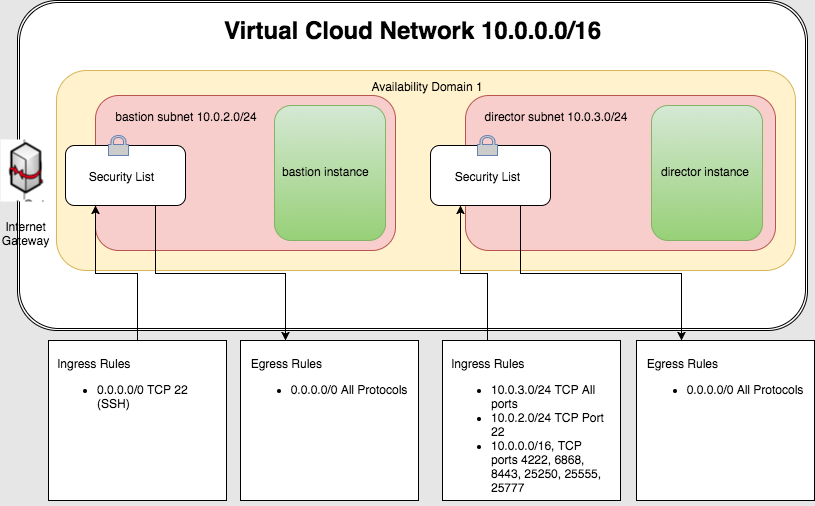

## Deploying BOSH Director Guide

Deploying a BOSH director on OCI consists of two high level tasks 
 1. Setting up the necessary OCI resources in your tenancy 
 2. Using [BOSH CLI v2 create-env](https://bosh.io/docs/cli-v2#create-env) command to create a director environment

### Creating OCI resources

BOSH director is deployed from a bastion instance in OCI. The bastion and the director instances 
are created in different subnets.  The security rules for these subnets are configured such 
that the director is not exposed to public IP (accessible only from the bastion subnet) 
and only ssh traffic is allowed into the bastion subnet. 

Pictorially this can be represented as 

---



---

All the required resources -- VCN, Subnets, Security Lists, Bastion instance -- can be created
using the [Terraform OCI CF/BOSH installer](https://github.com/oracle/terraform-oci-cf-install). 


### Creating a BOSH director environment

* SSH into the bastion instance created by the [Terraform OCI CF/BOSH installer](https://github.com/oracle/terraform-oci-cf-install)
* The installer places two files under $HOME
   * install_deps.sh -- Executable script for installing the bosh cli v2 and its dependencies (make, ruby)
   * director-env-vars.yml -- A BOSH variables file containing the values for variables referred to by various ops files
* Install bosh cli 
 ```
   $ ./install_deps.sh
 ```
* Clone this repo to get OCI specific ops files and bosh cli wrapper scripts
 ```bash
   $ git clone https://github.com/oracle/bosh-oracle-cpi-release.git
 ```
* Deploy director 
```bash
   $ cd bosh-oracle-cpi-release/bosh-deployment
   $ ./create-env.sh 
```
